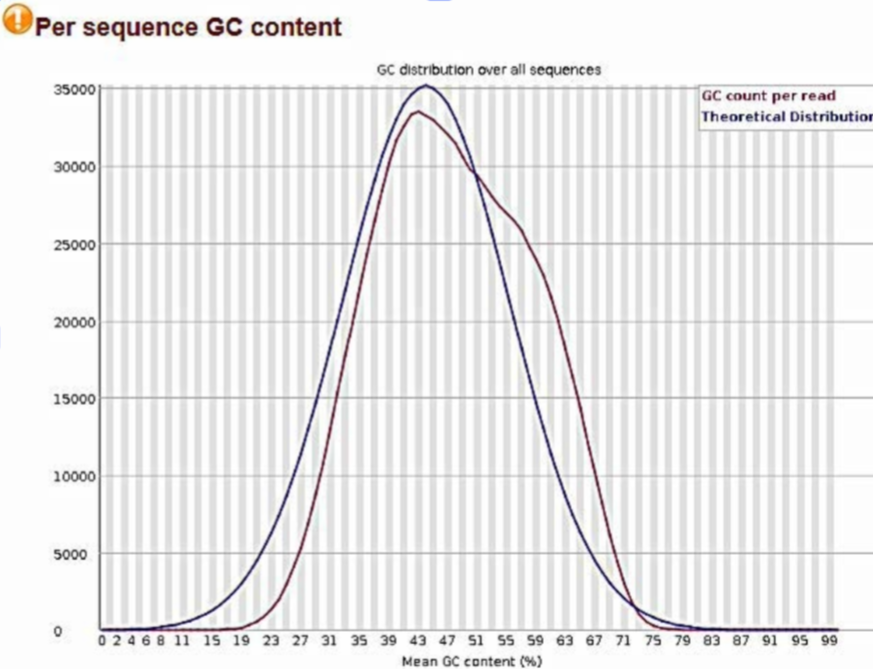
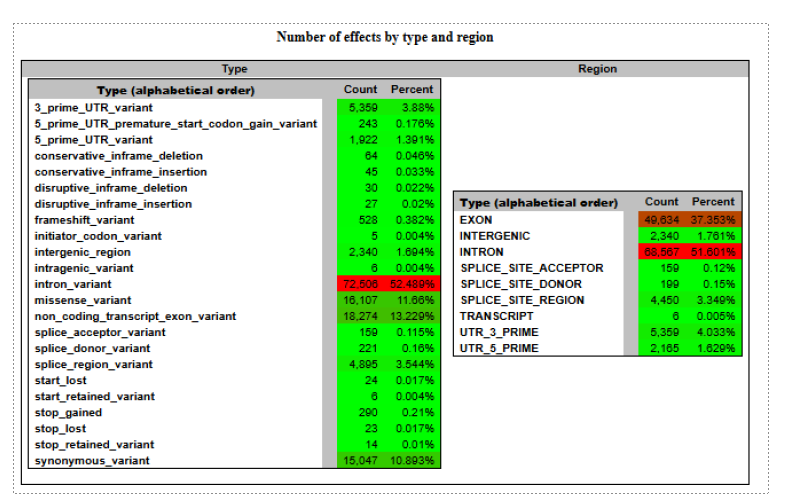
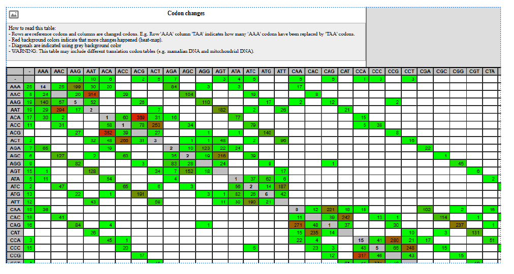

# NGS Variant Calling Workflow

This repository presents a bioinformatics workflow for detecting genetic variants from next-generation sequencing (NGS) data using widely used genomic analysis tools available through the Galaxy platform.

---

## Project Overview

The aim of this project is to process raw sequencing reads, evaluate their quality, align them to the human reference genome (hg19), and identify genetic variants present in the analyzed sample.

The workflow represents a typical **NGS variant detection pipeline** used in genomic research and bioinformatics analysis.

---

## Workflow Steps

### 1. Quality Control

Raw sequencing reads were evaluated using **FASTQC** to assess:

- Base quality scores
- GC content distribution
- Sequence duplication levels
- Adapter contamination

High average **Phred quality scores (>30)** indicate reliable sequencing data suitable for downstream analysis.

---

### 2. Read Alignment

Reads were aligned to the human reference genome **hg19** using **BWA-MEM**.

The alignment generated a **BAM file**, which was then sorted and processed for downstream analysis.

Alignment statistics were obtained using **SAMtools**, showing:

- ~99% successfully mapped reads
- High proportion of properly paired reads

These metrics indicate high-quality alignment of sequencing reads.

---

### 3. Variant Detection

Genetic variants were identified using **FreeBayes**, a haplotype-based variant detector.

The analysis detected approximately **29,000 genomic variants**, including:

- SNPs (Single Nucleotide Polymorphisms)
- Insertions
- Deletions

Each variant includes information about:

- Chromosome location
- Genomic position
- Reference allele
- Alternative allele
- Variant quality score

---

### 4. Variant Annotation

Detected variants were functionally annotated using **SnpEff**, which predicts the biological impact of genetic variants.

Annotated effects include:

- Missense mutations
- Nonsense mutations
- Silent mutations
- Variants located in regulatory regions (UTRs)
- Intronic variants

The observed transition/transversion ratio is consistent with expected biological ranges.

---

### 5. Visualization

Alignment and variant data can be explored using genome visualization tools:

- **IGV (Interactive Genomics Viewer)**
- **UCSC Genome Browser**
- **bam.iobio**

These tools allow inspection of sequencing coverage, alignment quality, and genomic variant positions.

---

## Tools and Technologies

- Galaxy Platform  
- FASTQC  
- BWA-MEM  
- SAMtools  
- FreeBayes  
- SnpEff  
- IGV  
- UCSC Genome Browser  
- R / RStudio  

---

## Repository Structure

```
data/       Raw sequencing reads  
scripts/    Scripts used for preprocessing  
results/    Variant calling and annotation outputs  
report/     Analysis report  
images/     Figures and workflow screenshots
```

---

# Results

## Quality Control

Sequencing read quality was evaluated using FASTQC.  
The distribution of per-sequence quality scores shows that most reads have **Phred scores above 30**, indicating high sequencing accuracy and reliable data for downstream analysis.


---

## GC Content Distribution

The GC content distribution follows the expected pattern for human genomic data, suggesting no significant contamination or sequencing bias.



---

## Alignment Visualization

Aligned sequencing reads were visually inspected using IGV to validate mapping quality and confirm coverage across genomic regions.


---

## Variant Annotation Summary

Variant annotation using **SnpEff** revealed multiple variant types across different genomic regions.  
The summary below shows the distribution of variant effects and their genomic locations.



---

## Codon Change Matrix

The codon change matrix generated by **SnpEff** summarizes substitutions between codons observed in the dataset.  
Rows represent the reference codon and columns represent the mutated codon, indicating the frequency of each substitution.



---

## Purpose

This repository demonstrates a typical **NGS variant calling workflow**, illustrating the main steps required to process, analyze, and interpret genomic sequencing data.

---

## Author

Diana Gutierrez  
Bioinformatics / Genomics
