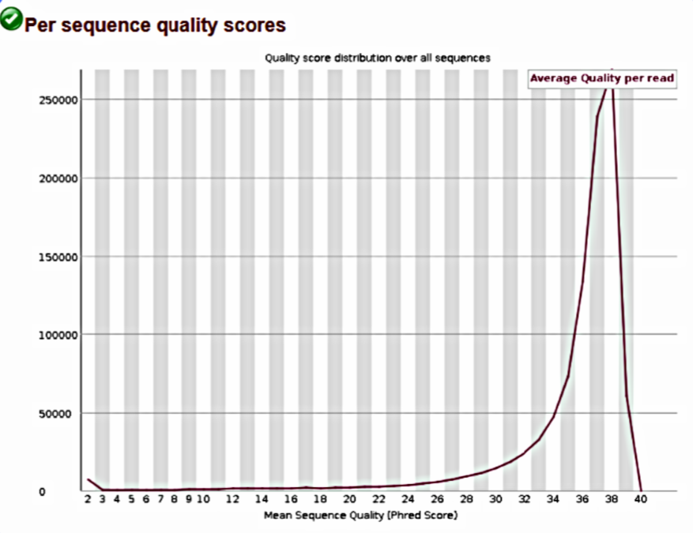

# NGS Variant Calling Workflow

This repository presents a bioinformatics workflow for detecting genetic variants from next-generation sequencing (NGS) data using commonly used genomic analysis tools available in the Galaxy platform.

---

## Project Overview

The aim of this project is to process raw sequencing reads, evaluate their quality, align them to the human reference genome (hg19), and identify genetic variants present in the sample.

The workflow follows a typical variant detection pipeline used in genomic research.

---

## Workflow Steps

### 1. Quality Control

Raw sequencing reads were evaluated using **FASTQC** to assess:

- Base quality scores
- GC content distribution
- Sequence duplication levels
- Adapter contamination

High average **Phred quality scores (>30)** indicate reliable sequencing data suitable for downstream analysis.

---

### 2. Read Alignment

Reads were aligned to the human reference genome **hg19** using **BWA-MEM**.

The alignment generated a **BAM file**, which was then processed and sorted for downstream analysis.

Alignment statistics were obtained using **SAMtools**, showing:

- ~99% successfully mapped reads
- High proportion of properly paired reads

These metrics indicate a high-quality alignment.

---

### 3. Variant Detection

Genetic variants were identified using **FreeBayes**, a haplotype-based variant detector.

The analysis detected approximately **29,000 genomic variants**, including:

- SNPs (Single Nucleotide Polymorphisms)
- Insertions
- Deletions

Variant information includes:

- Chromosome location
- Genomic position
- Reference allele
- Alternative allele
- Variant quality score

---

### 4. Variant Annotation

Detected variants were functionally annotated using **SnpEff**, which provides information about the potential biological impact of each variant.

Annotated effects include:

- Missense mutations
- Nonsense mutations
- Silent mutations
- Variants in regulatory regions (UTRs)
- Intronic variants

The transition/transversion ratio observed is consistent with expected biological ranges.

---

### 5. Visualization

Alignment and variant data can be explored using genome visualization tools:

- **IGV (Interactive Genomics Viewer)**
- **UCSC Genome Browser**
- **bam.iobio**

These tools allow inspection of sequencing coverage, alignment quality, and genomic variant positions.

---

## Tools and Technologies

- Galaxy Platform
- FASTQC
- BWA-MEM
- SAMtools
- FreeBayes
- SnpEff
- IGV
- UCSC Genome Browser
- R / RStudio

---

## Repository Structure

```
data/       Raw sequencing reads  
scripts/    Scripts used for preprocessing  
results/    Variant calling and annotation outputs  
report/     Analysis report  
images/     Figures and workflow screenshots
```

---

## Quality Control Results

Sequencing read quality was evaluated using FASTQC.  
The distribution of per-sequence quality scores shows that most reads have **Phred scores above 30**, indicating high sequencing accuracy and reliable data for downstream analysis.



---

## Workflow Visualization

### GC Content Distribution

The GC content distribution follows the expected pattern for human genomic data, suggesting no significant contamination or sequencing bias.


---

### Alignment Visualization

Aligned reads can be visually inspected using genome browsers such as IGV or the UCSC Genome Browser.  
These tools allow detailed inspection of sequencing coverage and variant positions across genomic regions.


---

### Alignment Statistics

Alignment statistics indicate high mapping efficiency and proper pairing of reads, supporting the reliability of the sequencing data and alignment process.


---

## Purpose

This repository demonstrates a typical **NGS variant calling workflow** used in genomic data analysis and illustrates the main steps required to process, analyze, and interpret sequencing data.

---

## Author

Diana Gutierrez  
Bioinformatics / Genomics
